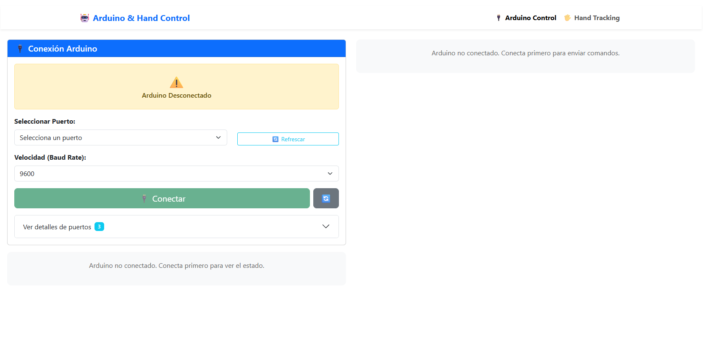
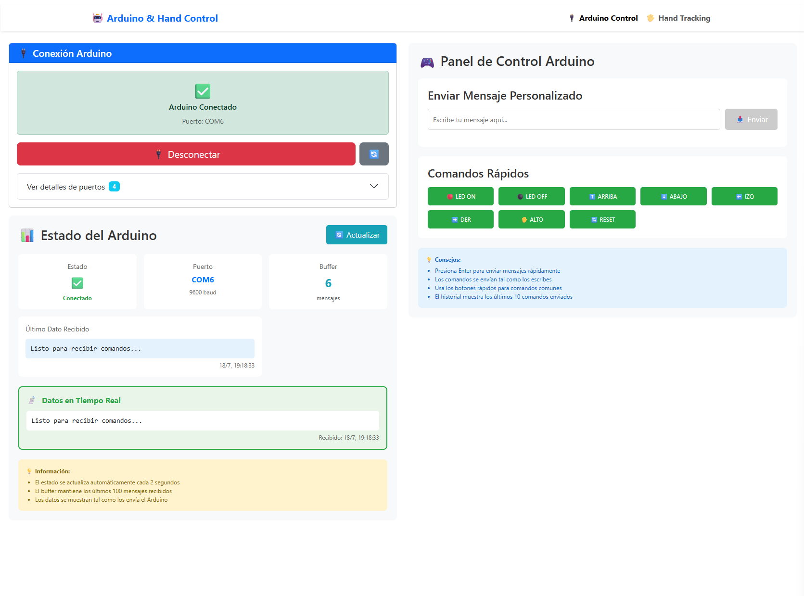

# 🎮 Control Platform

Universal platform for gesture-based hardware control with real-time communication. Control any serial device using hand gestures detected through your webcam.

## 🏗️ Architecture

This platform consists of two independent applications that work together:

### 🖐️ Gesture Control Dashboard
**Location**: `gesture-control-dashboard/`

Interactive web interface with real-time hand tracking capabilities.

- **Framework**: React + TypeScript + Vite
- **UI**: Bootstrap + React-Bootstrap (Responsive)
- **Hand Tracking**: MediaPipe Hands
- **Communication**: Axios HTTP client
- **Port**: `http://localhost:5173`

**Features:**
- Real-time hand gesture detection
- Movement recognition (up, down, left, right, stop)
- Responsive control interface
- Device status monitoring
- Command history

### 📡 Serial Device API
**Location**: `serial-device-api/`

Universal REST API for communicating with serial devices (Arduino, ESP32, etc.).

- **Framework**: Node.js + Express
- **Serial Communication**: SerialPort library
- **Protocol**: RESTful API with CORS
- **Port**: `http://localhost:3001`

**Features:**
- Automatic serial port detection
- Device connection management
- Real-time data streaming
- Command buffering
- Hardware-agnostic design

## 🚀 Quick Start

### Prerequisites
- Node.js >= 18.0.0
- npm >= 9.0.0
- Webcam (for gesture detection)
- Serial device (Arduino, ESP32, etc.)

### Installation

```bash
# Clone the repository
git clone https://github.com/username/control-platform.git
cd control-platform

# Install dependencies for both projects
npm run setup

# Start both applications
npm run dev
```

### Individual Setup

```bash
# Frontend only
npm run install:dashboard
npm run dev:dashboard

# Backend only  
npm run install:api
npm run dev:api
```

## 📱 Usage

1. **Connect your Arduino/device** to a USB port
2. **Start the platform**: `npm run dev`
3. **Open the dashboard**: http://localhost:5173
4. **Select your device port** from the connection interface
5. **Click "Connect"** to establish communication
6. **Enable hand tracking** and start controlling with gestures!

### Supported Gestures

| Gesture | Action | Description |
|---------|--------|-------------|
| 👆 **Index Up** | UP | Move finger upward |
| 👇 **Index Down** | DOWN | Move finger downward |
| 👈 **Index Left** | LEFT | Move finger to the left |
| 👉 **Index Right** | RIGHT | Move finger to the right |
| ✊ **Closed Fist** | STOP | Close all fingers |

## 🛠️ Development

### Available Scripts

```bash
# Development
npm run dev              # Start both applications
npm run dev:dashboard    # Frontend only (port 5173)
npm run dev:api         # Backend only (port 3001)

# Build
npm run build           # Build frontend for production
npm run preview         # Preview production build

# Maintenance
npm run setup           # Install all dependencies
npm run clean           # Remove all node_modules
npm run clean:build     # Remove build artifacts
```
### Screens


### Project Structure

```
control-platform/
├── README.md
├── package.json                      # Development scripts
├── .gitignore
├── gesture-control-dashboard/        # Frontend React App
│   ├── package.json
│   ├── src/
│   │   ├── components/
│   │   ├── hooks/
│   │   ├── context/
│   │   ├── repositories/
│   │   └── utils/
│   ├── public/
│   └── vite.config.ts
├── serial-device-api/               # Backend Node.js API
│   ├── package.json
│   ├── server.js
│   ├── routes/
│   ├── controllers/
│   └── .env
└── docs/
    └── api-documentation.md
```

## 🔌 API Endpoints

### Device Management
- `GET /arduino/ports` - List available serial ports
- `POST /arduino/connect` - Connect to device
- `POST /arduino/disconnect` - Disconnect from device
- `GET /arduino/status` - Get connection status

### Communication
- `POST /arduino/send` - Send data to device
- `GET /arduino/read` - Read latest data
- `GET /arduino/history` - Get data history
- `POST /arduino/command` - Send formatted command

## 🎯 Supported Hardware

### Tested Devices
- ✅ Arduino Uno
- ✅ Arduino Nano
- ✅ ESP32
- ✅ Arduino Leonardo

### Protocol Requirements
Your device should handle newline-terminated strings:
```cpp
// Arduino example
void setup() {
  Serial.begin(9600);
}

void loop() {
  if (Serial.available()) {
    String command = Serial.readStringUntil('\n');
    
    if (command == "UP") {
      // Handle up gesture
    } else if (command == "STOP") {
      // Handle stop gesture
    }
    // ... other commands
  }
}
```

## 🚀 Deployment

### Frontend (Static)
Deploy to Vercel, Netlify, or any static hosting:

```bash
cd gesture-control-dashboard
npm run build
# Upload dist/ folder
```

### Backend (Server)
Deploy to Railway, Heroku, or VPS:

```bash
cd serial-device-api
# Set environment variables
# Deploy using your preferred method
```

### Environment Variables

**Frontend** (`.env`):
```bash
VITE_API_BASE_URL=http://localhost:3001
```

**Backend** (`.env`):
```bash
PORT=3001
ARDUINO_PORT=COM3          # Windows
# ARDUINO_PORT=/dev/ttyUSB0  # Linux
# ARDUINO_PORT=/dev/ttyACM0  # Mac
ARDUINO_BAUDRATE=9600
```

## 🧪 Testing

```bash
# Test gesture detection
curl http://localhost:5173

# Test API connection
curl http://localhost:3001/arduino/ports

# Test device communication
curl -X POST http://localhost:3001/arduino/send \
  -H "Content-Type: application/json" \
  -d '{"data":"UP"}'
```

## 🤝 Contributing

1. Fork the repository
2. Create your feature branch (`git checkout -b feature/amazing-feature`)
3. Commit your changes (`git commit -m 'Add amazing feature'`)
4. Push to the branch (`git push origin feature/amazing-feature`)
5. Open a Pull Request

## 📝 License

This project is licensed under the MIT License - see the [LICENSE](LICENSE) file for details.

## 🆘 Troubleshooting

### Common Issues

**Camera not working:**
- Ensure browser permissions for camera access
- Try HTTPS (some browsers require secure context)

**Arduino not detected:**
- Check USB cable and drivers
- Verify correct COM port in device manager
- Ensure Arduino IDE isn't using the port

**Connection timeout:**
- Restart the backend server
- Check if the port is already in use
- Verify Arduino is sending/receiving data

**Gesture detection not working:**
- Ensure good lighting conditions
- Keep hand clearly visible to camera
- Try adjusting MediaPipe confidence settings

### Getting Help

- 📚 Check the [API Documentation](docs/api-documentation.md)
- 🐛 [Report issues](https://github.com/username/control-platform/issues)
- 💬 [Join discussions](https://github.com/username/control-platform/discussions)

---

**Built with ❤️ for makers, developers, and hardware enthusiasts**