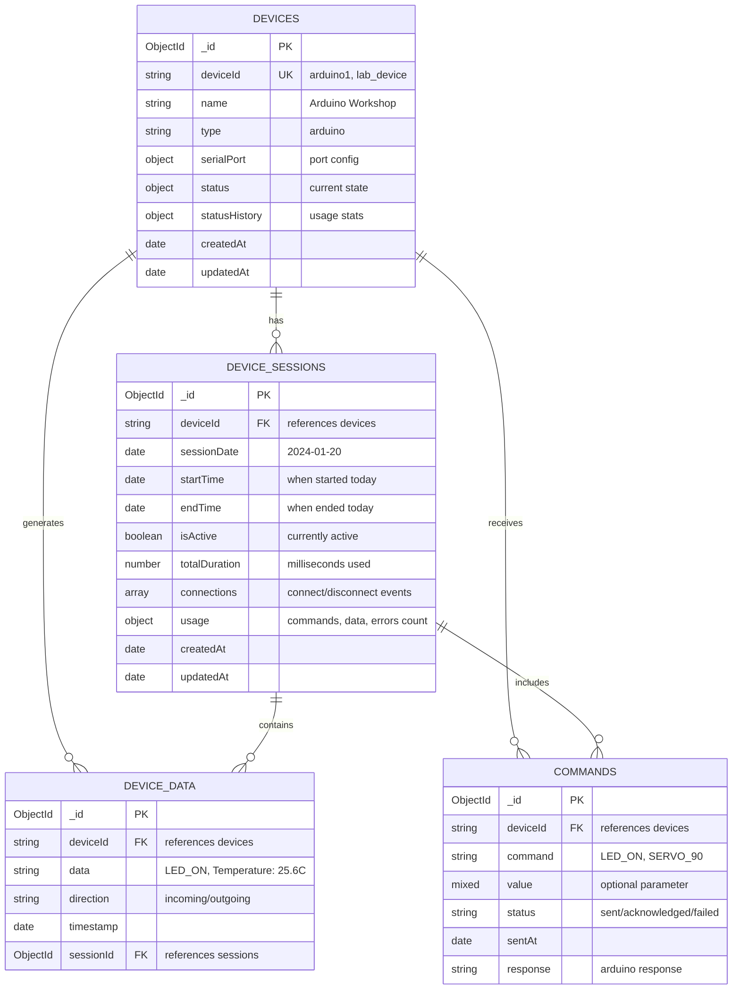
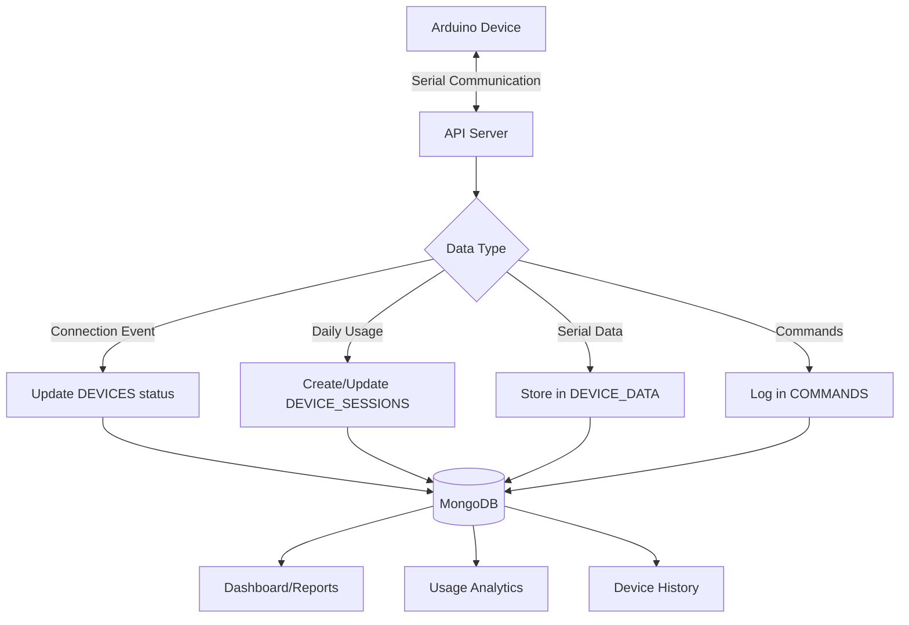

# Control Platform Database Structure

## MongoDB Collections Overview



## Detailed Schema Structure

### 🔧 DEVICES Collection
```javascript
{
  _id: ObjectId("..."),
  deviceId: "arduino1",                    // Unique device identifier
  name: "Workshop Arduino Uno",           // Human-friendly name
  type: "arduino",                        // Device type
  
  serialPort: {
    path: "/dev/cu.usbmodem14101",        // Serial port path
    manufacturer: "Arduino LLC",          // Device manufacturer
    serialNumber: "85735313038351F03181", // Hardware serial
    vendorId: "2341",                     // USB vendor ID
    productId: "0043",                    // USB product ID
    baudRate: 9600                       // Communication speed
  },
  
  status: {
    isConnected: true,                    // Current connection state
    lastConnected: "2024-01-20T10:00:00Z", // Last connection time
    bufferSize: 45                       // Current data buffer size
  },
  
  statusHistory: {
    totalConnections: 125,               // Lifetime connections
    totalDisconnections: 124,            // Lifetime disconnections
    totalUptime: 8640000,               // Total milliseconds connected
    lastStatusChange: "2024-01-20T10:00:00Z",
    averageConnectionDuration: 69120     // Average session length
  },
  
  createdAt: "2024-01-15T08:30:00Z",
  updatedAt: "2024-01-20T10:00:00Z"
}
```

### 📊 DEVICE_SESSIONS Collection (Daily Usage Tracking)
```javascript
{
  _id: ObjectId("..."),
  deviceId: "arduino1",                   // Which device
  sessionDate: "2024-01-20T00:00:00Z",   // Day of usage (midnight)
  startTime: "2024-01-20T09:15:00Z",     // First connection today
  endTime: "2024-01-20T17:30:00Z",       // Last activity today
  isActive: false,                       // Currently in use
  totalDuration: 3600000,                // Total milliseconds used today
  
  connections: [                         // All connect/disconnect events today
    {
      connectedAt: "2024-01-20T09:15:00Z",
      disconnectedAt: "2024-01-20T12:00:00Z",
      duration: 9900000,                 // This connection duration
      reason: "session_start"            // Why connected
    },
    {
      connectedAt: "2024-01-20T13:00:00Z",
      disconnectedAt: "2024-01-20T17:30:00Z", 
      duration: 16200000,
      reason: "reconnection"
    }
  ],
  
  usage: {
    commandsSent: 47,                    // Commands sent today
    dataReceived: 152,                   // Data packets received today
    gesturesDetected: 23,                // Hand gestures detected
    errors: 2                           // Errors encountered
  },
  
  createdAt: "2024-01-20T09:15:00Z",
  updatedAt: "2024-01-20T17:30:00Z"
}
```

### 📡 DEVICE_DATA Collection (Serial Communication Log)
```javascript
{
  _id: ObjectId("..."),
  deviceId: "arduino1",                   // Which device sent/received
  data: "Temperature: 25.6C",            // Actual data content
  direction: "incoming",                  // "incoming" or "outgoing"
  timestamp: "2024-01-20T10:30:15Z",     // When data was transmitted
  sessionId: ObjectId("...")             // Links to device_sessions
}

// Examples of different data types:
{
  data: "LED_ON",                        // Outgoing command
  direction: "outgoing"
}
{
  data: "Temperature: 25.6C, Humidity: 60%", // Incoming sensor data
  direction: "incoming"
}
{
  data: "255",                           // Numeric data
  direction: "outgoing"
}
```

### ⚡ COMMANDS Collection (Command History & Status)
```javascript
{
  _id: ObjectId("..."),
  deviceId: "arduino1",                   // Target device
  command: "LED_ON",                      // Command sent
  value: "255",                          // Optional parameter
  status: "acknowledged",                 // sent/acknowledged/failed
  sentAt: "2024-01-20T10:30:00Z",        // When command was sent
  response: "OK"                         // Arduino's response
}

// Examples of different commands:
{
  command: "SERVO",                      // Servo control
  value: 90,                            // Angle parameter
  status: "sent"
}
{
  command: "RESET",                      // Simple command
  value: null,                          // No parameter
  status: "failed",
  response: "Device timeout"
}
```

## Data Flow Visualization



## Real-World Example Data Flow

### Morning: User connects Arduino
1. **DEVICES** - Status updated to `isConnected: true`
2. **DEVICE_SESSIONS** - New session created for today
3. **DEVICE_DATA** - Connection event logged

### During Day: User sends commands
```bash
POST /api/v1/arduino/send/arduino1 {"data": "LED_ON"}
```
1. **DEVICE_DATA** - Outgoing data: `"LED_ON"`
2. **COMMANDS** - Command logged with status `"sent"`
3. **DEVICE_SESSIONS** - Usage counter incremented

### Arduino responds with sensor data
1. **DEVICE_DATA** - Incoming data: `"Temperature: 25.6C"`
2. **DEVICE_SESSIONS** - Data received counter incremented

### Evening: User disconnects
1. **DEVICES** - Status updated to `isConnected: false`
2. **DEVICE_SESSIONS** - Session ended, duration calculated
3. **DEVICE_DATA** - Disconnection event logged

## Database Indexes for Performance

```javascript
// DEVICE_DATA - Fast queries by device and time
db.device_data.createIndex({ "deviceId": 1, "timestamp": -1 })
db.device_data.createIndex({ "sessionId": 1 })

// COMMANDS - Fast command history lookup  
db.commands.createIndex({ "deviceId": 1, "sentAt": -1 })
db.commands.createIndex({ "status": 1 })

// DEVICE_SESSIONS - Fast session queries
db.device_sessions.createIndex({ "deviceId": 1, "sessionDate": -1 })
db.device_sessions.createIndex({ "isActive": 1 })

// DEVICES - Fast device lookup
db.devices.createIndex({ "deviceId": 1 }, { unique: true })
db.devices.createIndex({ "status.isConnected": 1 })
```

## Query Examples

### Get today's usage for a device
```javascript
db.device_sessions.findOne({
  deviceId: "arduino1",
  sessionDate: {
    $gte: new Date("2024-01-20T00:00:00Z"),
    $lt: new Date("2024-01-21T00:00:00Z")
  }
})
```

### Get last 50 data entries for a device
```javascript
db.device_data.find({ deviceId: "arduino1" })
  .sort({ timestamp: -1 })
  .limit(50)
```

### Get failed commands in last 24 hours
```javascript
db.commands.find({
  status: "failed",
  sentAt: { $gte: new Date(Date.now() - 24*60*60*1000) }
})
```

This database structure provides:
- ✅ **Complete audit trail** of all device interactions
- ✅ **Daily usage tracking** for analytics
- ✅ **Real-time status** monitoring  
- ✅ **Historical data** for trends and debugging
- ✅ **Scalable design** for multiple devices